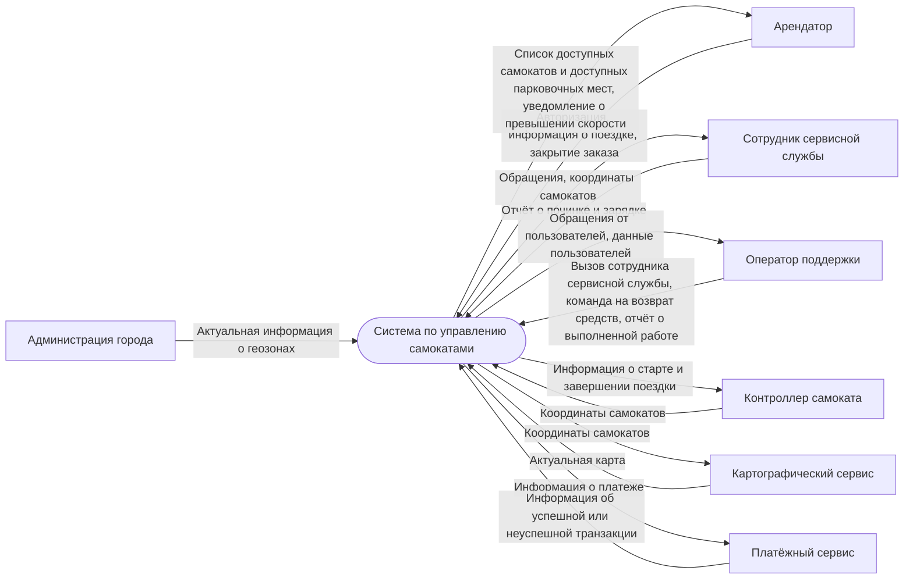

# 4. Контекстная диаграмма

Система - «чёрный ящик»

```mermaid
flowchart LR
    S(["Система по управлению самокатами"])
    A["Арендатор"]
    B["Администрация города"]
    C["Сотрудник сервисной службы"]
    D["Оператор поддержки"]
    E["Контроллер самоката"]
    F["Картографический сервис"]
    P["Платёжный сервис"]
    A -->|"Авторизация, информация о поездке, закрытие заказа"| S
    S -->|"Список доступных самокатов и доступных парковочных мест, уведомление о превышении скорости"| A
    B -->|"Актуальная информация о геозонах"| S
    C -->|"Отчёт о починке и зарядке"| S
    S -->|"Обращения, координаты самокатов"| C
    S -->|"Обращения от пользователей, данные пользователей"| D
    D -->|"Вызов сотрудника сервисной службы, команда на возврат средств, отчёт о выполненной работе"| S
    S -->|"Информация о старте и завершении поездки"| E
    E -->|"Координаты самокатов"| S
    S -->|"Координаты самокатов"| F
    F -->|"Актуальная карта"| S
    S -->|"Информация о платеже"| P
    P -->|"Информация об успешной или неуспешной транзакции"| S
```

